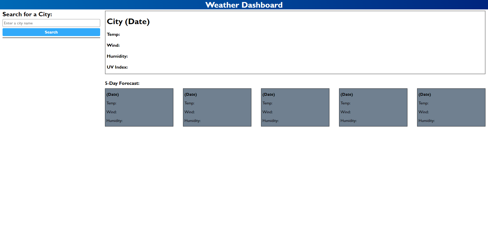

# Weather Dashboard

A web application that will take a city and provide the user with the current weather, and a 5 day forecast.

## Functionality

- Enter a city into the search bar.
- Use the search button to search for the designated city's current weather and 5-day forecast.
- Up to 10 previously searched cities are saved below the search bar for you to easily click and request it's weather data again.
## Screenshot

## Link to Live Page

https://concord511.github.io/Weather-Dashboard/